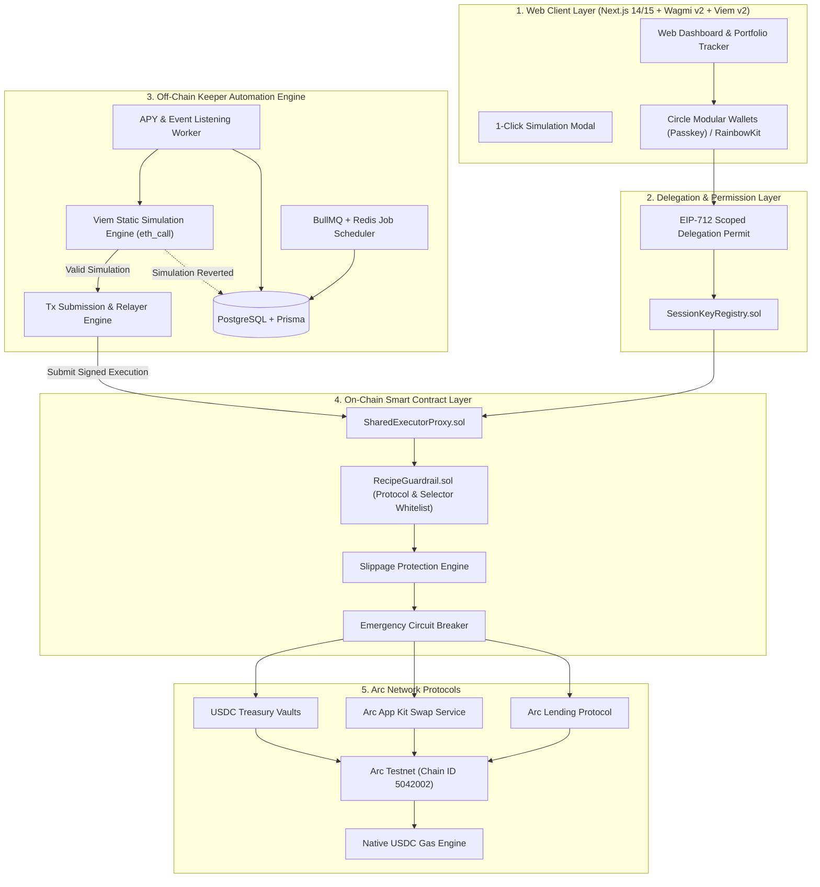

# DeFi Recipes on Arc - Architectural Proposal & System Best Practices

**Version:** 1.0 (Comprehensive Architecture & Best Practices Specification)  
**Status:** Proposal / For Review  
**Target Blockchain:** Arc Network (Chain ID: `5042002`, Native USDC Gas)  
**Primary Token:** USDC (`0x3600000000000000000000000000000000000000`)  

---

## 1. Executive Summary & Core Design Philosophy

**DeFi Recipes on Arc** is a non-custodial yield and financial workflow automation layer built specifically for **Arc Network**. Arc offers sub-second finality, ultra-low transaction costs, and native USDC gas fees, making it an optimal environment for automated financial strategies.

To guarantee high security, rapid execution, and exceptional user experience, this architecture adheres to five fundamental design principles:

1. **Shared Executor Proxy Pattern**: All user automated workflows are routed through a single, heavily audited proxy contract (`SharedExecutorProxy`) rather than deploying individual custom contracts per user or recipe.
2. **Scoped Session Key Delegation (ERC-4337 / EIP-712)**: Users retain 100% custody. Off-chain keepers receive strictly restricted, time-bound execution rights limited to whitelisted protocol targets and function selectors.
3. **Pre-Flight Static Simulation (`eth_call`)**: Every off-chain automation job simulates transaction execution using Viem v2 static calls before broadcasting to the Arc RPC network, eliminating failed transactions and wasted gas.
4. **Strict Dual-View USDC Asset Integrity**: Proper separation between the 6-decimal ERC-20 token view (`0x36...00`) used for all portfolio operations and the 18-decimal native gas view used exclusively for protocol gas math.
5. **EVM Compatibility Alignment (`paris` target)**: Contract compilation targets the `paris` EVM spec to guarantee compatibility with Arc Testnet opcodes (avoiding Shanghai `PUSH0` issues).

---

## 2. Comprehensive System Architecture Diagram



---

## 3. Layer-by-Layer Architectural Deep-Dive

### 3.1. On-Chain Smart Contract Layer (Foundry & Solidity `^0.8.24`)

#### Architecture Components:
* `SharedExecutorProxy.sol`: The core execution hub. It receives execution requests from authorized keepers, validates caller permissions against `SessionKeyRegistry`, and delegates calls to target protocols.
* `RecipeGuardrail.sol`: Security enforcement module verifying:
  * Target protocol address is in `isWhitelistedProtocol`.
  * Function selector is explicitly enabled in `isSelectorAllowed`.
  * Output balance after step execution satisfies minimum return amount (`minAmountOut`).
* `SessionKeyRegistry.sol`: Tracks session keys, delegation expiry timestamps (`validUntil`), maximum USDC transaction spend limits, and revocation status.

#### Key Security Patterns & Best Practices:
* **EVM Paris Target**: `foundry.toml` must be configured with `evm_version = "paris"` to prevent opcode incompatibility on Arc.
* **Reentrancy Protection**: Inherits OpenZeppelin `ReentrancyGuardUpgradeable` on all state-changing execution methods.
* **Slippage Bounds**: All token swap and liquidity extraction steps calculate minimum expected outputs against oracle prices (Pyth / market oracles) and Arc App Kit Swap route quotes, with configurable maximum slippage tolerance (0.5%–1.0%).

```solidity
// Example guardrail validation inside SharedExecutorProxy.sol
function executeRecipeStep(
    address user,
    address targetProtocol,
    bytes calldata callData,
    uint256 minAmountOut
) external onlyAuthorizedKeeper nonReentrant whenNotPaused {
    require(guardrail.isWhitelistedProtocol(targetProtocol), "ERR_PROTOCOL_NOT_WHITELISTED");
    bytes4 selector = bytes4(callData[:4]);
    require(guardrail.isSelectorAllowed(targetProtocol, selector), "ERR_SELECTOR_NOT_ALLOWED");

    uint256 balanceBefore = IERC20(USDC_ADDRESS).balanceOf(user);
    
    (bool success, ) = targetProtocol.call(callData);
    require(success, "ERR_EXECUTION_FAILED");

    uint256 balanceAfter = IERC20(USDC_ADDRESS).balanceOf(user);
    if (minAmountOut > 0) {
        require(balanceAfter >= balanceBefore + minAmountOut, "ERR_SLIPPAGE_EXCEEDED");
    }
}
```

---

### 3.2. Off-Chain Keeper Automation Engine (Node.js / TypeScript + BullMQ + Viem v2)

The Keeper Engine is responsible for automated strategy execution based on time-based triggers (cron) or market condition events (APY changes, health factor thresholds).

#### Core Engine Subsystems:
1. **Scheduler Service (BullMQ + Redis)**:
   * Manages recurring cron jobs for DCA and Auto-Compounding.
   * Leverages Redis for distributed job locking to prevent double-execution across worker instances.
2. **Monitoring & Event Listening Worker**:
   * Subscribes to Arc RPC block logs via WebSocket.
   * Computes real-time yield differences between Arc Lending pools and Treasury Vaults.
3. **Static Simulation Engine (`eth_call` via Viem v2)**:
   * **Mandatory Pre-Execution Simulation**: Before sending a live transaction, the keeper calls `publicClient.simulateContract()`.
   * If the simulation reverts or indicates excessive slippage, the transaction is immediately cancelled, logged to PostgreSQL, and an alert is raised without spending gas.
4. **Relayer & Retry Engine**:
   * Uses exponential backoff retry strategy (`1s, 2s, 4s, 8s`).
   * Dynamically fetches fee parameters from Arc RPC and submits transactions via keeper wallets.

---

### 3.3. Frontend & User Experience Layer (Next.js + Wagmi v2 + Viem v2)

#### UX & Wallet Features:
* **Passkey / Social Login & Web3 Support**: Integrated with Circle Modular Wallets (Passkey WebAuthn) for non-custodial onboarding, as well as RainbowKit for standard Web3 wallets (MetaMask, Rabby).
* **Pre-Flight 1-Click Simulation Modal**:
  * Before confirming a recipe, users view a visual simulation showing exact execution steps, protocol targets, maximum slippage, and estimated USDC gas cost.
* **Single USDC Asset Representation**:
  * Balances and transfers strictly reference the 6-decimal ERC-20 contract (`0x36...00`). Native gas math is kept isolated under backend hood.

---

## 4. Arc Network Best Practices & Guidelines Matrix

| Domain | Best Practice / Constraint | Implementation Guidelines |
| :--- | :--- | :--- |
| **Native Asset** | USDC is Native Gas | All transaction fees on Arc are paid in USDC. No ETH or secondary gas tokens needed. |
| **Asset Views** | Dual View Integrity | Maintain strict separation between 6-decimal ERC-20 view for UI/transfers and 18-decimal native view for gas. Never sum or swap between views. |
| **Solidity Compiler** | Target `paris` EVM | Set `evm_version = "paris"` in `foundry.toml`. Avoid Shanghai opcodes (`PUSH0`). |
| **Smart Contracts** | Shared Executor Proxy | Avoid deploying per-user contracts. Route executions through audited `SharedExecutorProxy.sol`. |
| **Auth & Security** | Scoped EIP-712 Delegation | Limit session key scopes to whitelisted target contracts, allowed function selectors, and spend caps. |
| **Off-Chain Keeper** | Pre-Flight Viem Simulation | Run `publicClient.simulateContract` (`eth_call`) before broadcasting any transaction. |
| **Web3 Client** | Viem v2 & Wagmi v2 | Use native `arcTestnet` chain definition from Viem v2 (`Chain ID: 5042002`). |

---

## 5. Security & Risk Mitigation Matrix

```
┌─────────────────────────────────────────────────────────────────────────┐
│                    SECURITY GUARDRAILS ARCHITECTURE                      │
├─────────────────────────────────────────────────────────────────────────┤
│ 1. USER DELEGATION LAYER: EIP-712 Signature + Session Expiry + Revoke    │
│ 2. OFF-CHAIN LAYER: Viem Static Simulation (eth_call) Before Broadcast  │
│ 3. ON-CHAIN LAYER: SharedExecutorProxy + Protocol/Selector Whitelist     │
│ 4. FINANCIAL LAYER: Oracle Price Checks + Min Output Slippage Enforcement│
│ 5. EMERGENCY LAYER: Admin Global Circuit Breaker & User 1-Click Pause    │
└─────────────────────────────────────────────────────────────────────────┘
```

---

## 6. Next Steps & Implementation Roadmap

1. **Phase 1 (Smart Contracts & Verification)**: Implement `SharedExecutorProxy.sol`, `RecipeGuardrail.sol`, and `SessionKeyRegistry.sol` using Foundry compiled for EVM `paris`. Run fork tests on Arc Testnet.
2. **Phase 2 (Keeper Engine & Simulation)**: Build Node.js TypeScript worker service with BullMQ, Redis, and Viem `eth_call` static simulation engine.
3. **Phase 3 (Frontend & Web3 Integration)**: Build Next.js 14/15 App Router web application with Wagmi v2, RainbowKit, Circle Modular Wallets, and 1-Click Simulation Modal.

---

## 7. Performance Architecture Update (v1.1)

### 7.1 Keeper Execution Path
- Scheduler performs pre-flight simulation once and marks jobs with preflight metadata.
- Worker submits transactions and immediately releases concurrency slots after submit.
- Transaction confirmation/finality is processed by a dedicated async confirmation worker.
- Receipt timeouts and rate-limit retries are handled with queue-level retry policy and backoff.

### 7.2 Observability
- Added in-memory keeper metrics with `/metrics` endpoint:
    - `cronCycleDurationMs` p50/p95
    - `rpcCallsPerCycle` p50/p95
    - queue lead time enqueue->submitted and enqueue->confirmed
    - simulation rate-limit failure rate

### 7.3 Frontend Wallet UX
- Submit/confirm flow now uses non-blocking lifecycle:
    - submitted immediately in UI
    - confirmation polling runs in background
    - timeout state escalates to background finalizer retries
- Local session metrics expose perceived performance:
    - time-to-submitted p95
    - time-to-confirmed p95
