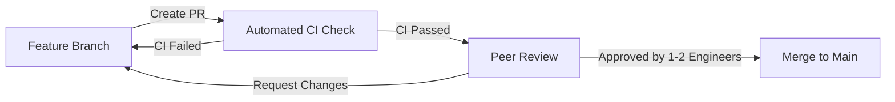

# Quy trình Review Mã nguồn (Code Review Process) - DeFi Recipes on Arc

**Phiên bản:** 1.0  
**Áp dụng cho:** Tất cả Pull Requests (PR) trên repository `DeFiRecipesonArc`.

---

## 1. Mạch Quy trình Kiểm duyệt (Code Review Workflow)



1. **Khởi tạo PR:** Developer tạo PR từ nhánh tính năng (`feat/*`, `fix/*`) trỏ vào nhánh `main`.
2. **Kiểm tra Tự động (CI Checks):** GitHub Actions tự động chạy `forge test`, `eslint`, `tsc --noEmit` và `prettier --check`.
3. **Phân công Peer Review:** Phân công ít nhất **1 Senior Contract Engineer** (đối với code Solidity) hoặc **1 Frontend/Backend Lead** (đối với code FE/BE).
4. **Phê duyệt & Merge:** PR chỉ được phép Merge khi có đủ **tối thiểu 1 Approval** và **0 Unresolved Conversations**.

---

## 2. Trách nhiệm trong Quy trình Review

### 2.1. Trách nhiệm của Tác giả PR (PR Author)
- Giải thích rõ ràng mục đích của PR trong phần Description.
- Đính kèm bằng chứng kiểm thử (Screenshot giao diện, Log kết quả Forge test thành công, Coverage report).
- Đảm bảo PR nhỏ gọn, tập trung (kích thước đề xuất: **< 400 dòng code thay đổi**).

### 2.2. Trách nhiệm của Người Review (Reviewer)
- Kiểm tra tính đúng đắn về mặt logic và an ninh tài sản (Smart Contract Security).
- Kiểm tra việc tuân thủ các quy chuẩn [Coding Style](file:///d:/source-code/arc/DeFiRecipesonArc/docs/coding-style.md) và [Coding Rules](file:///d:/source-code/arc/DeFiRecipesonArc/docs/coding-rules.md).
- Thảo luận mang tính xây dựng, giải thích rõ lý do khi yêu cầu thay đổi (Request Changes).

---

## 3. Danh mục Kiểm tra Review (Review Checklists)

### 3.1. Checklist dành cho Smart Contracts (Solidity)
- [ ] Hàm có chứa modifier `nonReentrant` nếu thực hiện chuyển token hoặc external call không?
- [ ] Tất cả external call có được giới hạn bởi `RecipeGuardrail` (Protocol & Selector Whitelist) không?
- [ ] Đã có kiểm tra trượt giá (Slippage Check) cho các thao tác swap/withdraw chưa?
- [ ] Đã viết Unit Test và Fuzz Test phủ hết các trường hợp biên (Edge cases) chưa?
- [ ] Code có gây lãng phí Gas không (sử dụng `custom error` thay vì string, `calldata` thay vì `memory`)?

### 3.2. Checklist dành cho Frontend & Keeper Engine
- [ ] Code có tuyệt đối không chứa `any` type không?
- [ ] Đã kiểm tra đúng Chain ID (`5042002`) và xử lý lỗi khi người dùng từ chối ký ví chưa?
- [ ] Mọi hiển thị số dư USDC có tuân thủ 6 decimals không?
- [ ] Có link ArcScan cho tất cả các Transaction Hash trên UI không?
- [ ] Keeper service có thực hiện `simulateContract` trước khi gửi transaction không?

---

## 4. Mẫu Pull Request Chuẩn (Pull Request Template)

Tất cả các PR tạo trên GitHub/GitLab phải sử dụng mẫu dưới đây:

```markdown
## 📝 Mục đích PR
<!-- Mô tả ngắn gọn tính năng hoặc lỗi được xử lý trong PR này -->

## 🔗 Issues liên quan
- Closes #<!-- issue number -->

## 🛠 Thay đổi chính
- [ ] `contracts/`: ...
- [ ] `frontend/`: ...
- [ ] `keeper/`: ...

## 🧪 Bằng chứng Kiểm thử (Proof of Testing)
<!-- Đính kèm log output của forge test hoặc screenshot UI -->
```bash
forge test --match-contract SharedExecutorTest
# Results: 14 passed; 0 failed
```

## 📋 Checklist trước khi Merge
- [ ] Đã chạy `npm run lint` và `npx prettier --check .` không lỗi.
- [ ] Đã bổ sung Unit test tương ứng cho code mới.
- [ ] Không chứa thông tin nhạy cảm (Private keys, API keys).
```
