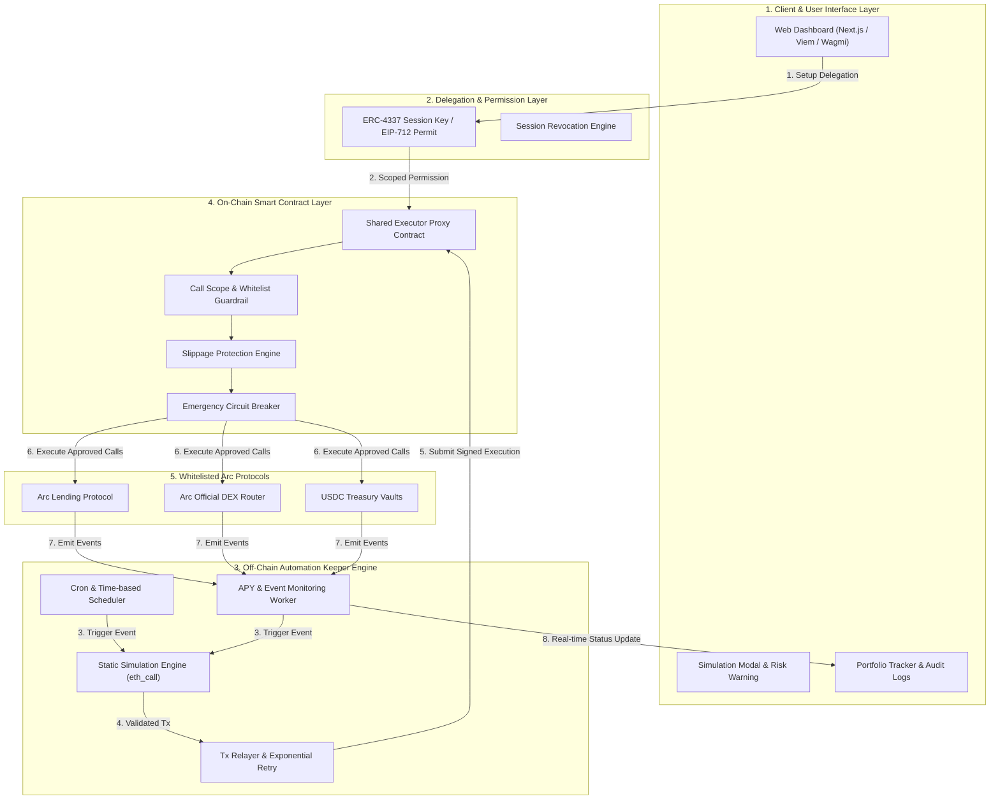
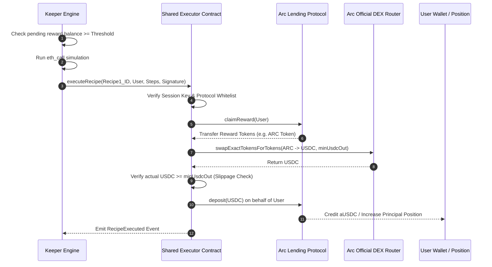
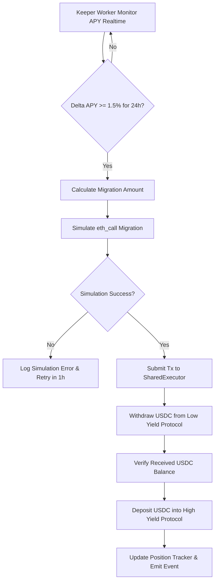
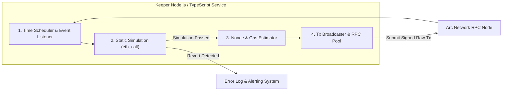

# DeFi Recipes on Arc - Feature Specifications Document (PRD / SRS)

**Version:** 2.0 (Detailed Granular Specification)  
**Status:** Approved Specification  
**Base Document:** [Project Vision v2.1](file:///d:/source-code/arc/DeFiRecipesonArc/docs/project-vision.md)  
**Network:** Arc Network (Native USDC Gas, Sub-second Finality)  
**Target Release:** MVP Phase 1 & Roadmap to Phase 2  

---

## 1. Tổng quan & Mục tiêu (Executive Summary)

Tài liệu này quy định chi tiết về mặt **nghiệp vụ, kiến trúc dữ liệu và kỹ thuật phần mềm** cho nền tảng **DeFi Recipes on Arc**. 

Nền tảng hoạt động như một **lớp tự động hoá công việc DeFi phi lưu ký (Non-Custodial Workflow Automation Layer)**, giúp người dùng lập trình và tự động hoá các chiến lược tài chính liên quan đến USDC trên mạng lưới Arc. Người dùng duy trì 100% quyền sở hữu tài sản thông qua cơ chế uỷ quyền phạm vi hẹp (Scoped Delegation / Session Keys), trong khi hợp đồng thực thi tập trung (`SharedExecutorProxy`) và bộ kích hoạt off-chain (`KeeperEngine`) đảm bảo quy trình chạy chính xác, minh bạch và an toàn tuyệt đối.

### Phân kỳ Phát triển (Phased Scope)
* **Phase 1 (MVP P0):** 
  * 3 Recipes cốt lõi: **USDC Yield Auto-Compounder**, **USDC Recurring DCA**, **USDC Smart Yield Rebalancer**.
  * Audited `SharedExecutorProxy` Smart Contract với rào chắn bảo vệ (Guardrails) & kiểm tra trượt giá (Slippage Check).
  * Node.js/TypeScript Worker Service (Time-based Cron, APY Monitor, Static Simulation via `eth_call`).
  * Web Dashboard: Luồng kích hoạt 1-Click, Hộp thoại Giả lập (Simulation Modal), Trình quản lý Portfolio & Audit Log realtime.
  * Phí giao dịch: Miễn phí nền tảng trong giai đoạn MVP (Keeper tài trợ phí gas USDC trên Arc).
* **Phase 2 (P1 Roadmap):**
  * 2 Recipes mở rộng: **USDC Safety Net / Stop-Loss Protection**, **USDC Fixed-Interval Savings Stream**.
  * Nâng cấp Keeper Engine phân tán Multi-region & Tích hợp Circle SCP Wallet Delegation / Account Abstraction Native.
  * Tùy chọn khấu trừ Performance Fee (ví dụ: 2% trên phần thưởng Compound).

---

## 2. Kiến trúc Hệ thống Tổng quan (System Architecture)



---

## 3. Danh sách Chi tiết Tính năng (Feature Specifications)

---

### Epic 1: User Onboarding & Scoped Delegation (Ví & Uỷ quyền)

#### F-1.1: Tích hợp Ví & Kết nối Mạng Arc (Wallet Integration)
* **Mô tả:** Cho phép người dùng kết nối các ví Web3 chuẩn (MetaMask, Rabby, Coinbase Wallet, Circle Smart Account) với Arc Network.
* **Yêu cầu chi tiết:**
  * Auto-detect & switch network sang Arc Network (`ChainId`, `RPC_URL`, Native Currency: `USDC`).
  * Kiểm tra và hiển thị số dư USDC tức thời (đóng vai trò tài sản chính và Native Gas Token).
  * Trạng thái kết nối được lưu giữ trong local storage / state management (`Wagmi` / `Viem`).

#### F-1.2: Cấp quyền Uỷ quyền Phạm vi Hẹp (Scoped Delegation / Session Keys)
* **Mô tả:** Người dùng ký uỷ quyền để cho phép `KeeperEngine` thay mặt thực thi các bước quy định trong Recipe mà **không bàn giao Private Key** và **không cho phép chuyển khoản tự do**.
* **Luồng dữ liệu (Data Payload):**
  ```typescript
  interface SessionKeyPermission {
    userAddress: string;          // Địa chỉ ví người dùng
    sessionPublicKey: string;     // Public Key do Keeper Engine quản lý
    validUntil: number;           // Unix Timestamp hết hạn (mặc định: 30-90 ngày)
    allowedTarget: string;        // CHỈ ĐƯỢC LÀ SharedExecutorProxy Address
    allowedSelectors: string[];   // Danh sách hàm được phép gọi (vd: executeRecipeStep)
    usdcSpendLimitPerTx: bigint; // Hạn mức USDC tối đa mỗi lần giao dịch
  }
  ```
* **Rào chắn bảo vệ (Guardrails):**
  * Tự động từ chối nếu `allowedTarget` khác địa chỉ `SharedExecutorProxy` chính thức.
  * Session Key tự động mất hiệu lực khi đến mốc `validUntil`.

#### F-1.3: Quản lý & Thu hồi Uỷ quyền (Session Management & Revocation)
* **Trạng thái Uỷ quyền (Delegation State Machine):**
  ```mermaid
  stateDiagram-v2
      [*] --> Uninitialized
      Uninitialized --> Active: User Signs Delegation
      Active --> Expired: Current Time > ValidUntil
      Active --> Revoked: User Clicks Revoke / Pause
      Active --> Paused: Circuit Breaker Triggered
      Expired --> Active: User Re-news Delegation
      Revoked --> Active: User Re-authorizes
  ```
* **Yêu cầu UI/UX:**
  * Bảng điều khiển "Active Delegations" hiển thị rõ: Tên Recipe đang cấp quyền, Thời gian hết hạn còn lại, Hạn mức giao dịch.
  * Nút **"Revoke Delegation" 1-Click**: Kích hoạt giao dịch hủy uỷ quyền on-chain hoặc gửi signal thu hồi đến Keeper Engine trong dưới 1 giây.

---

### Epic 2: On-Chain Shared Executor Engine & Smart Contracts (Smart Contract Thực thi)

#### F-2.1: Shared Executor Contract (Proxy Thực thi Tập trung)
* **Mô tả:** Contract đã được kiểm toán (Audited Proxy) chịu trách nhiệm nhận lệnh thực thi từ Keeper, kiểm tra uỷ quyền và điều hướng dòng tiền qua các protocol gốc.
* **Interface Solidity chính:**
  ```solidity
  // SPDX-License-Identifier: MIT
  pragma solidity ^0.8.20;

  interface ISharedExecutor {
      struct ExecutionStep {
          address targetProtocol;   // Địa chỉ Protocol (vd: Arc Lending)
          bytes callData;           // Dữ liệu mã hoá hàm cần gọi
          uint256 minAmountOut;     // Hạn mức trượt giá tối thiểu nhận về
      }

      event RecipeExecuted(
          bytes32 indexed recipeId,
          address indexed user,
          address indexed keeper,
          uint256 usdcProcessed,
          uint256 timestamp
      );

      event EmergencyPaused(address indexed triggeredBy, string reason);

      function executeRecipe(
          bytes32 recipeId,
          address user,
          ExecutionStep[] calldata steps,
          bytes calldata userSignature
      ) external returns (bool success);

      function setProtocolWhitelist(address protocol, bool isApproved) external;
      function setEmergencyPause(bool paused) external;
  }
  ```

#### F-2.2: Protocol Whitelist & Call Scope Guardrails (Rào chắn Bảo vệ On-chain)
* **Kiểm soát địa chỉ:** `SharedExecutor` duy trì `mapping(address => bool) public isWhitelistedProtocol`. Mọi giao dịch gọi tới địa chỉ ngoài Whitelist sẽ bị `revert("ERR_PROTOCOL_NOT_WHITELISTED")`.
* **Kiểm soát hàm (Function Selector Validation):**
  * Chỉ cho phép các hàm chuẩn của DeFi Protocol: `deposit()`, `withdraw()`, `swapExactTokensForTokens()`, `claimRewards()`.
  * Tuyệt đối cấm các hàm `transferFrom()` trực tiếp tới ví thứ 3 không nằm trong luồng xử lý của Recipe.

#### F-2.3: Slippage & Price Impact Protection Engine (Bảo vệ Trượt giá)
* **Mô tả:** Ngăn chặn các cuộc tấn công Sandwich / Front-running khi Keeper thực hiện Swap trên Arc DEX.
* **Cơ chế:**
  * Mọi bước Swap bắt buộc truyền `minAmountOut`.
  * Trước khi Swap, Contract truy vấn giá tham chiếu từ Pyth/Chainlink Oracle hoặc TWAP của Arc DEX.
  * Nếu $\text{ActualOutput} < \text{ExpectedOutput} \times (1 - \text{SlippageTolerance})$, giao dịch lập tức bị Revert với lỗi `ERR_SLIPPAGE_EXCEEDED`.

#### F-2.4: Emergency Pause / Circuit Breaker (Cầu chì Ngắt Khẩn cấp)
* **Cấp hệ thống (Global Admin Pause):** Admin/Multisig có quyền tạm dừng `SharedExecutor` khi phát hiện lỗ hổng trên Arc Protocol đối tác.
* **Cấp cá nhân (User Personal Pause):** Người dùng có thể gọi `pauseUserRecipes()` trực tiếp để đóng băng tất cả thực thi liên quan đến ví của mình mà không cần chờ Keeper.

---

### Epic 3: Technical Specifications for Official Recipes (Chi tiết 5 Official Recipes)

---

#### F-3.1: Recipe 1 - USDC Yield Auto-Compounder (P0 - MVP Core)

* **Mục tiêu:** Tự động thu hoạch phần thưởng (Rewards) từ Arc Lending và tái đầu tư vào vị thế USDC để tối ưu lãi suất kép.
* **Tần suất thực thi:** Định kỳ hàng tuần (Cron) HOẶC khi Lượng Reward tích lũy $\ge 5 \text{ USDC}$.
* **Quy trình chi tiết (Detailed Workflow):**



* **Tham số Đầu vào (Input Parameters):**
  * `minRewardThreshold`: Lượng reward tối thiểu để kích hoạt compound (mặc định: `5000000` = 5 USDC).
  * `maxSlippageBps`: Ngưỡng trượt giá tối đa tính theo điểm cơ bản (mặc định: `50` = 0.5%).
  * `checkIntervalHours`: Chu kỳ kiểm tra của Keeper (mặc định: 24 giờ).
* **Xử lý Lỗi & Ngoại lệ (Edge Cases):**
  * *Reward quá nhỏ không đủ bù phí gas:* Keeper tự động bỏ qua lượt execution cho đến khi reward đủ điều kiện.
  * *Liquidity trên DEX quá mỏng gây trượt giá cao:* Revert giao dịch, Keeper gửi cảnh báo log và thử lại sau 6 giờ.

---

#### F-3.2: Recipe 2 - USDC Recurring DCA (P0 - MVP Core)

* **Mục tiêu:** Tự động tích lũy tài sản chiến lược (WETH / WBTC) bằng USDC theo lịch trình cố định.
* **Tần suất thực thi:** Hàng tuần / Hàng tháng (Ví dụ: 09:00 AM UTC Thứ Hai hàng tuần).
* **Quy trình chi tiết (Detailed Workflow):**
  1. Keeper kiểm tra lịch trình kích hoạt và xác minh số dư USDC khả dụng trong ví người dùng.
  2. Keeper thực hiện `eth_call` kiểm tra tỷ giá WETH/USDC trên Arc DEX.
  3. Gửi lệnh qua `SharedExecutor`: Rút lượng USDC đã cấu hình (vd: 50 USDC) từ ví người dùng qua lệnh uỷ quyền Session Key.
  4. Thực hiện Swap USDC $\rightarrow$ WETH trên Arc DEX với `minWethOut`.
  5. Chuyển thẳng số WETH thu được về ví cá nhân của người dùng.
* **Tham số Đầu vào (Input Parameters):**
  * `dcaAmountUsdc`: Số tiền USDC cho mỗi lần mua (vd: `50000000` = 50 USDC).
  * `targetAsset`: Địa chỉ hợp đồng của tài sản muốn mua (WETH / WBTC).
  * `frequency`: Chu kỳ mua (`WEEKLY` / `MONTHLY`).
  * `maxSlippageBps`: Trượt giá cho phép (`50` = 0.5%).
* **Xử lý Lỗi & Ngoại lệ (Edge Cases):**
  * *Số dư USDC ví người dùng không đủ:* Keeper bỏ qua lượt DCA đó, đánh dấu trạng thái `SKIPPED_INSUFFICIENT_BALANCE` và gửi notification trên UI Dashboard.
  * *Session Key hết hạn:* Đổi trạng thái Recipe sang `PAUSED_EXPIRED_DELEGATION`, yêu cầu người dùng gia hạn.

---

#### F-3.3: Recipe 3 - USDC Smart Yield Rebalancer (P0 - MVP Core)

* **Mục tiêu:** Tự động di chuyển vốn giữa Arc Lending và USDC Treasury Vaults để liên tục hưởng APY cao nhất.
* **Điều kiện kích hoạt (Trigger Condition):**
  $$\Delta APY = |APY_{\text{Lending}} - APY_{\text{Vault}}| \ge 1.5\% \quad \text{duy trì liên tục } \ge 24 \text{ giờ}$$
* **Quy trình chi tiết (Detailed Workflow):**



* **Tham số Đầu vào (Input Parameters):**
  * `minApyDeltaBps`: Chênh lệch APY tối thiểu để rebalance (`150` = 1.5%).
  * `sustainedDurationHours`: Thời gian duy trì chênh lệch bắt buộc (`24` giờ).
  * `rebalanceRatioBps`: Tỷ lệ vốn di chuyển (`10000` = 100% vị thế).
* **Xử lý Lỗi & Ngoại lệ (Edge Cases):**
  * *Protocol nguồn bị khóa rút tiền (Withdraw Lock / Liquidity Crunch):* Keeper phát hiện lỗi qua Static Simulation, lập tức ngắt giao dịch và cảnh báo `LIQUIDITY_CRUNCH_DETECTED`.

---

#### F-3.4: Recipe 4 - USDC Safety Net / Stop-Loss Protection (P1 - Phase 2 Roadmap)

* **Mục tiêu:** Tự động rút tiền gửi hoặc rút vốn trả nợ để bảo vệ vị thế vay khỏi rủi ro thanh lý khi thị trường biến động.
* **Điều kiện kích hoạt:**
  $$\text{Health Factor (HF)} < 1.15 \quad \text{HOẶC} \quad \text{Collateral Price drops } > 15\% / 1\text{h}$$
* **Quy trình chi tiết (Detailed Workflow):**
  1. Keeper Event Monitor theo dõi `HealthFactor` của người dùng trên Arc Lending 24/7.
  2. Khi HF chạm ngưỡng cảnh báo ($HF < 1.15$):
     * Keeper lập tức gửi giao dịch ưu tiên cao (High Gas Priority) đến `SharedExecutor`.
     * `SharedExecutor` rút một phần tài sản thế chấp (USDC/WETH) hoặc dùng USDC dự phòng trong ví để trả bớt khoản vay (Repay Debt).
     * Đưa Health Factor trở lại vùng an toàn ($HF \ge 1.40$).
* **Tham số Đầu vào (Input Parameters):**
  * `minHealthFactor`: Ngưỡng HF kích hoạt bảo vệ (mặc định: `1150` = 1.15).
  * `targetHealthFactor`: Ngưỡng HF an toàn sau khi xử lý (mặc định: `1400` = 1.40).

---

#### F-3.5: Recipe 5 - USDC Fixed-Interval Savings Stream (P1 - Phase 2 Roadmap)

* **Mục tiêu:** Tự động trích một tỷ lệ % cố định từ dòng tiền USDC nhận vào ví để gửi vào Vault tiết kiệm tích lũy.
* **Điều kiện kích hoạt:** Phát sinh sự kiện `Transfer(to = UserWallet, value >= minIncomingUsdc)`.
* **Quy trình chi tiết (Detailed Workflow):**
  1. Keeper theo dõi sự kiện nhận USDC trên ví người dùng.
  2. Khi có khoản nộp vào (vd: nhận lương $1,000$ USDC):
     * Keeper trích đúng $X\%$ (vd: $20\% = 200$ USDC).
     * Gửi $200$ USDC vào Treasury Vaults sinh lãi.
     * Để lại $800$ USDC còn lại trong ví để người dùng chi tiêu linh hoạt.
* **Tham số Đầu vào (Input Parameters):**
  * `savingsAllocationBps`: Tỷ lệ trích tiết kiệm (`2000` = 20%).
  * `minIncomingUsdc`: Hạn mức giao dịch tối thiểu để kích hoạt (`100000000` = 100 USDC).

---

### Epic 4: Off-Chain Automation Keeper Engine (Bộ Kích hoạt Off-Chain)



#### F-4.1: Cron & Event Monitoring Service
* **Lập lịch thời gian:** Sử dụng `node-cron` kết hợp BullMQ Redis Queue để quản lý hàng nghìn job thực thi song song.
* **Giám sát sự kiện (Event Monitoring):** Kết nối WebSocket với RPC Node của Arc Network để lắng nghe các Event: `Sync`, `AnswerUpdated` (Oracle), `Borrow`, `Repay`.

#### F-4.2: On-Chain Static Simulation Engine (`eth_call`)
* **Mô tả:** Bắt buộc mô phỏng tĩnh giao dịch trước khi broadcast lên mạng Arc.
* **Quy trình kiểm tra:**
  ```typescript
  async function simulateRecipeExecution(params: ExecutionParams): Promise<boolean> {
    try {
      const result = await publicClient.simulateContract({
        address: SHARED_EXECUTOR_ADDRESS,
        abi: SharedExecutorABI,
        functionName: 'executeRecipe',
        args: [params.recipeId, params.user, params.steps, params.signature],
        account: KEEPER_ACCOUNT,
      });
      return true; // Simulation success
    } catch (error) {
      console.error(`Simulation Reverted for user ${params.user}:`, error);
      await logSimulationFailure(params, error);
      return false; // Skip execution to save gas
    }
  }
  ```

#### F-4.3: Transaction Relayer & Exponential Backoff Retry Mechanism
* **Cơ chế nộp lại giao dịch (Retry Policy):**
  * Nếu giao dịch bị rớt do lag RPC hoặc Nonce mâu thuẫn: Thử lại tối đa **3 lần**.
  * Khoảng thời gian giãn cách thử lại (Exponential Backoff): $T_{\text{wait}} = 2^k \times 1000\text{ms} + \text{jitter}$ (lần 1: 2s, lần 2: 4s, lần 3: 8s).
  * **Atomicity:** Giao dịch chỉ được coi là thành công khi nhận receipt với `status == 1` và đạt trạng thái Finalized trên Arc Network (Sub-second finality).

---

### Epic 5: Web Dashboard & User Experience (Giao diện Dashboard)

#### F-5.1: Danh sách Recipe & Luồng Kích hoạt 1-Click (1-Click Recipe Activation)
* **Giao diện Card Recipe:**
  * Badge Rủi ro (Low / Medium / High), Thống kê APY kỳ vọng.
  * Danh sách các Protocol tích hợp (Arc Lending logo, Arc DEX logo).
  * Nút "Activate Recipe".
* **Luồng Xác nhận 3 Bước (Modal Flow):**
  1. *Bước 1 - Configuration:* Nhập số tiền, chọn tần suất/ngưỡng kích hoạt, cài đặt trượt giá.
  2. *Bước 2 - Simulation Preview:* Hiển thị sơ đồ luồng tiền & kết quả chạy thử `eth_call`.
  3. *Bước 3 - Sign Delegation:* Ký Session Key / EIP-712 Permit qua ví Web3 $\rightarrow$ Kích hoạt thành công.

#### F-5.2: Trình Giả lập Giao dịch (Transaction Simulation Modal)
* **Thông tin minh bạch hiển thị cho người dùng:**
  * **Sơ đồ luồng tiền (Asset Flow Visualizer):** `[Ví Người Dùng] -> (USDC) -> [Arc Lending] -> (Reward) -> [Arc DEX] -> (USDC) -> [Arc Lending]`.
  * **Ước tính Phí Gas:** Phí Gas dự kiến tính bằng USDC (ví dụ: `~0.002 USDC` trên Arc Network).
  * **Cảnh báo Rủi ro:** Hiển thị lưu ý hợp đồng thông minh của bên thứ 3 (Arc Lending/DEX).

#### F-5.3: Portfolio Tracker & Audit Log Realtime
* **Thông số tổng quan:**
  * **Total Value Automated (TVA):** Tổng giá trị USDC đang chạy trong các Recipe.
  * **Total Yield Claimed:** Tổng lợi nhuận USDC đã tự động tích lũy/tái đầu tư.
* **Bảng Audit Log chi tiết (Thực thi Minh bạch):**

| Thời gian (UTC) | Recipe | Thao tác | Số tiền (USDC) | Trạng thái | Arc Explorer Tx Hash |
| :--- | :--- | :--- | :--- | :---: | :--- |
| 2026-07-27 10:00 | Yield Auto-Compounder | Claim & Re-deposit | +12.45 USDC | <span style="color:green">Success</span> | [`0xabc...123`](#) |
| 2026-07-27 09:00 | Recurring DCA | Swap USDC -> WETH | 50.00 USDC | <span style="color:green">Success</span> | [`0xdef...456`](#) |
| 2026-07-26 14:30 | Yield Rebalancer | Rebalance Lending -> Vault | 1,000.00 USDC | <span style="color:red">Reverted (Slippage)</span> | [`0x789...ghi`](#) |

---

## 4. Yêu cầu Phi Chức năng (Non-Functional Requirements)

### 4.1. Bảo mật & An toàn Tài sản (Security & Safety Standards)
* **Audited Codebase Requirement:** Tất cả smart contract trong thư mục `/contracts` bắt buộc thông qua Kiểm toán Độc lập (Third-Party Audit) trước khi triển khai Mainnet.
* **Non-Custodial Guarantee:** Smart contract tuyệt đối không giữ tiền người dùng qua đêm; tiền chỉ luân chuyển qua hợp đồng trong cùng 1 transaction atomic.
* **Least Privilege Enforcement:** Session Key bị giới hạn cứng về thời gian hết hạn, hạn mức USDC và địa chỉ contract đích.

### 4.2. Hiệu năng & Độ trễ (Performance Standards)
* **Sub-Second Confirmation:** Tận dụng tính năng Sub-second Finality của Arc Network để hoàn tất xác nhận giao dịch dưới 1 giây sau khi Keeper nộp giao dịch.
* **Monitoring Latency:** Keeper Event Worker phải phát hiện sự kiện biến động APY / Health Factor trong vòng dưới 15 giây.

### 4.3. Độ sẵn sàng & Tin cậy (Reliability & Fail-safe)
* **High Availability:** Off-chain Keeper Worker đạt độ sẵn sàng uptime $\ge 99.5\%$.
* **Fail-Safe Self-Recovery:** Trường hợp Keeper Worker gặp sự cố gián đoạn (Downtime), tiền của người dùng vẫn hoàn toàn an toàn tại ví cá nhân hoặc trong các vị thế lending gốc.

---

## 5. Phân kỳ Phát triển & Ma trận Tính năng (Feature Matrix & Roadmap)

| Hạng mục / Tính năng | Phase 1 (MVP P0) | Phase 2 (P1 Roadmap) | Phase 3 (Community Marketplace) |
| :--- | :---: | :---: | :---: |
| **Recipe 1: Yield Auto-Compounder** | **Full Specs (P0)** | Nâng cấp Multi-Vault | Custom Compound Strategy |
| **Recipe 2: Recurring DCA** | **Full Specs (P0)** | Multi-Asset Basket DCA | Limit Order Integration |
| **Recipe 3: Smart Yield Rebalancer** | **Full Specs (P0)** | AI-driven Yield Prediction | Cross-chain Rebalancing |
| **Recipe 4: Safety Net / Stop-Loss** | Tài liệu Specs (P1) | **Triển khai P1 Core** | Advanced Liquidation Shield |
| **Recipe 5: Savings Stream** | Tài liệu Specs (P1) | **Triển khai P1 Core** | Employer Payroll Stream |
| **Shared Executor Smart Contract** | **Audited Proxy Core** | Modular Contract Plugins | Custom Logic Assembly |
| **Off-Chain Keeper Engine** | **Node.js Single Worker** | Multi-Region Distributed | Decentralized Keeper Network |
| **Authorization Layer** | **ERC-4337 Session Keys** | Circle SCP Integration | Account Abstraction Native |
| **Giao diện Dashboard** | **Dashboard & Tracker** | Realtime Alert & Push | Visual Drag-and-Drop Builder |
| **Phí Nền tảng (Platform Fee)** | **Miễn phí (Free MVP)** | 2% Yield Performance Fee | Revenue Sharing Model |

---

## 6. Tổng kết (Summary)

Tài liệu **DeFi Recipes on Arc (v2.0)** đã hoàn thiện mô tả chi tiết từ cấp độ **Nghiệp vụ (Business Rules), Kiến trúc Smart Contract, Luồng xử lý Off-Chain Keeper cho đến Giao diện Người dùng**.

Bằng việc tập trung tối đa vào **3 Recipe cốt lõi (Auto-Compounder, DCA, Rebalancer)** cho phiên bản MVP Phase 1 cùng rào chắn bảo vệ an toàn trên `SharedExecutorProxy`, dự án thiết lập một nền tảng vững chắc để triển khai phát triển nhanh chóng, đảm bảo tính bảo mật và trải nghiệm người dùng vượt trội trên Arc Network.
