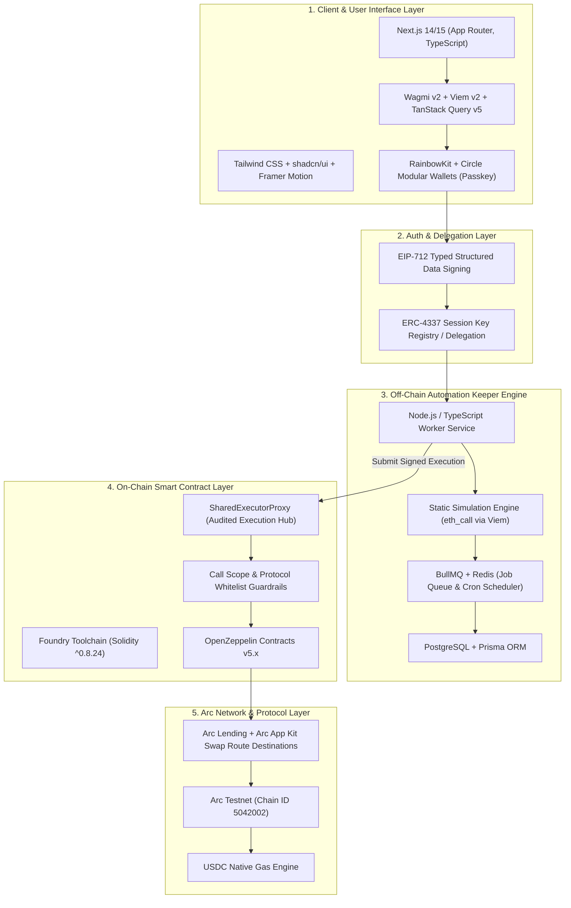

# DeFi Recipes on Arc - Technical Stack & Architecture Document

**Version:** 1.0 (Official Technical Architecture Specification)  
**Status:** Approved Specification  
**Base Documents:** [Project Vision v2.1](file:///d:/source-code/arc/DeFiRecipesonArc/docs/project-vision.md) | [Feature Specifications v2.0](file:///d:/source-code/arc/DeFiRecipesonArc/docs/features-spec.md) | [Architecture Proposal v1.0](file:///d:/source-code/arc/DeFiRecipesonArc/docs/architecture-proposal.md)  
**Target Blockchain:** Arc Network (Chain ID: `5042002`, Native USDC Gas)  
**Testnet Token Scope:** `USDC`, `EURC`, `cirBTC`  

---

## 1. Tổng quan Kiến trúc Công nghệ (Architectural Overview)

**DeFi Recipes on Arc** được thiết kế dưới dạng một lớp tự động hoá quy trình DeFi phi lưu ký (Non-Custodial Workflow Automation Layer). Kiến trúc hệ thống chia thành 5 phân lớp rõ ràng nhằm đảm bảo hiệu năng cao, độ trễ thấp (sub-second finality của Arc) và an toàn tuyệt đối cho tài sản người dùng.



---

## 2. Bảng Tổng hợp Tech Stack (Tech Stack Matrix)

| Phân lớp (Layer) | Công nghệ / Thư viện | Phiên bản (Version) | Vai trò & Lý do lựa chọn |
| :--- | :--- | :--- | :--- |
| **Smart Contracts** | Solidity | `^0.8.24` | Ngôn ngữ hợp đồng thông minh EVM chuẩn, hỗ trợ các tính năng EVM mới nhất. |
| **Contract Toolchain**| Foundry | `v0.2.0+` | Bộ công cụ phát triển, biên dịch, test và deploy siêu tốc bằng Rust (Forge, Cast, Anvil). |
| **Contract Security** | OpenZeppelin Contracts | `v5.x` | Thư viện hợp đồng tiêu chuẩn (`ReentrancyGuard`, `AccessControl`, `SafeERC20`, `Initializable`). |
| **Frontend Core** | Next.js (App Router) | `14.x / 15.x` | React Framework tối ưu SSR/SSG, hỗ trợ Server Components, SEO và route handler tốt. |
| **Frontend Language** | TypeScript | `v5.x` | Đảm bảo Type-Safety từ hợp đồng ABI đến giao diện người dùng. |
| **UI & Styling** | Tailwind CSS + `shadcn/ui` | `v3.4+` | Hệ thống thiết kế hiện đại, linh hoạt, dễ tùy biến giao diện cao cấp (Dark Mode, Glassmorphism). |
| **Animations** | Framer Motion | `v11.x` | Micro-animations mượt mà cho trải nghiệm người dùng cao cấp. |
| **Web3 Core** | Viem | `v2.x` | Thư viện EVM client siêu nhẹ, chuẩn TypeScript native, tốc độ cao gấp nhiều lần Ethers.js. |
| **Web3 React Hooks** | Wagmi | `v2.x` | Bộ React Hooks tiêu chuẩn tương tác với ví, hợp đồng, đọc/ghi trạng thái blockchain. |
| **State & Caching** | TanStack React Query | `v5.x` | Quản lý caching, fetching và revalidation dữ liệu blockchain/API client-side. |
| **Wallet Connector** | RainbowKit / Circle SDK | `v2.x` | Giao diện kết nối ví mượt mà, hỗ trợ ví truyền thống (MetaMask, Rabby) và Circle Passkey. |
| **Keeper Runtime** | Node.js / TypeScript | `v20 LTS` | Environment thực thi worker off-chain ổn định, bất đồng bộ hiệu năng cao. |
| **Job Queue Scheduler**| BullMQ + Redis | `v5.x / v7.x` | Quản lý danh sách công việc tự động (Cron job, APY check interval, retry khi thất bại). |
| **Database & ORM** | PostgreSQL + Prisma | `PostgreSQL 16 / Prisma 5.x` | Lưu trữ dữ liệu cấu hình Recipe, Session Key Metadata, Audit logs và Lịch sử giao dịch. |
| **Chain Integration** | Arc Network SDK / Config | Chain `5042002` | Mạng EVM của Circle sử dụng USDC làm Native Gas Token với sub-second finality. |
| **DevOps & Container**| Docker & Docker Compose | `v24+` | Đóng gói môi trường phát triển Keeper Node, PostgreSQL và Redis local nhất quán. |

---

> **Compatibility Note (Web Build):** `web/` currently targets Next.js `14.2.x` and is most stable on Node `20 LTS`. On Windows with Node `24.x`, use the repository build wrapper (`npm run build` in `web/`) which clears `.next` and disables Next build worker for deterministic output.

---

## 3. Chi tiết Thành phần Kiến trúc (Component Deep-Dive)

### 3.1. Smart Contract Layer (On-Chain Execution)

Lớp Smart Contract được thiết kế theo mô hình **Shared Executor Proxy** nhằm tối thiểu hóa bề mặt tấn công và tiết kiệm phí khởi tạo hợp đồng cho từng người dùng.

* **Kiến trúc Hợp đồng Cốt lõi:**
  * `SharedExecutorProxy.sol`: Hợp đồng đại lý trung tâm thực thi tất cả các bước trong Recipe.
  * `RecipeGuardrail.sol`: Bộ kiểm soát và xác thực quyền hạn (Caller Whitelist, Protocol Whitelist, Function Selector Scoping, Slippage Enforcement).
  * `SessionKeyRegistry.sol`: Nơi đăng ký và quản lý trạng thái hiệu lực của Session Keys từ người dùng.
* **Cơ chế Bảo vệ On-chain (Guardrails):**
  * **Strict Function Selector Scoping:** Chỉ cho phép thực thi các hàm đã được phê duyệt trong danh sách trắng (ví dụ: `deposit`, `withdraw`, `swap`).
  * **Target Contract Whitelisting:** Chỉ tương tác với các địa chỉ hợp đồng giao thức Arc đã qua kiểm toán và các swap route destinations được resolve qua Arc App Kit Swap (https://docs.arc.io/app-kit/swap).
  * **Slippage & Output Validation:** Kiểm tra số dư hoặc lượng token nhận được sau các thao tác swap/withdraw, hủy bỏ transaction (revert) nếu tỷ lệ trượt giá vượt mức cho phép (mặc định 0.5% - 1.0%).
  * **ReentrancyGuard:** Chống tấn công tái nhập trên tất cả các hàm thực thi.

```solidity
// Ví dụ mô phỏng cấu trúc kiểm tra Guardrail trên SharedExecutorProxy
function executeStep(
    address targetProtocol,
    bytes4 functionSelector,
    bytes calldata callData,
    uint256 maxSlippageBps
) external onlyAuthorizedKeeper nonReentrancy {
    require(guardrail.isProtocolWhitelisted(targetProtocol), "Protocol Not Allowed");
    require(guardrail.isSelectorAllowed(targetProtocol, functionSelector), "Function Not Allowed");
    
    // Thực thi lệnh đã được scoped
    (bool success, ) = targetProtocol.call(callData);
    require(success, "Execution Failed");
}
```

---

### 3.2. Off-Chain Keeper Automation Engine (Backend Layer)

`KeeperEngine` chịu trách nhiệm theo dõi điều kiện kích hoạt (Time-based cron hoặc Event/APY threshold) và gửi giao dịch thực thi đến `SharedExecutorProxy`.

* **Cấu trúc Dịch vụ (Modular Worker Architecture):**
  * **Scheduler Service:** Chạy các tác vụ lặp định kỳ (ví dụ: Auto-Compound hàng tuần, DCA hàng ngày).
  * **Monitoring Service:** Lắng nghe sự kiện on-chain, theo dõi biến động APY giữa Arc Lending và Treasury Vaults, theo dõi Collateral Ratio của người dùng.
  * **Static Simulation Engine:** Chạy hàm `eth_call` thông qua Viem để giả lập kết quả thực thi giao dịch off-chain trước khi broadcast lên mạng lưới Arc. Nếu giả lập thất bại hoặc bị revert, giao dịch sẽ không được gửi để tránh tốn chi phí và gây nghẽn mạng.
  * **Relayer & Retry Engine:** Xử lý việc ký giao dịch bằng Session Key, tự động tăng nonce/gas fee và retry theo chiến thuật Exponential Backoff khi mạng bận.
* **Mô hình Dữ liệu & Persistence (Prisma + PostgreSQL):**
  * Lưu trữ thông tin người dùng, Session Key Public Key, danh sách Recipe đang kích hoạt (`active` / `paused`), thông số tham số (chu kỳ DCA, ngưỡng Stop-Loss, mốc trượt giá).
  * Lưu trữ nhật ký thực thi chi tiết (`ExecutionLogs`) bao gồm Tx Hash, trạng thái, phí gas USDC đã tiêu tốn, thời gian thực thi.

---

### 3.3. Client & Web Dashboard Layer (Frontend)

Giao diện Web cung cấp trải nghiệm quản lý tự động hóa mượt mà, trực quan với tiêu chuẩn cao cấp.

* **Khả năng tương tác Web3:**
  * Sử dụng **Wagmi v2** và **Viem v2** tạo kết nối trực tiếp với Arc Network RPC.
  * Tích hợp **RainbowKit** hỗ trợ đa dạng ví Web3 và **Circle Modular Wallets** cho trải nghiệm đăng nhập không cần seed phrase (Passkey / WebAuthn).
* **Trình Giả lập Giao dịch (Simulation Modal):**
  * Trước khi người dùng xác nhận kích hoạt một Recipe, Frontend gọi API simulation để hiển thị trước:
    * Luồng di chuyển tài sản (Asset Flow).
    * Lượng gas dự kiến (bằng USDC).
    * Tỷ lệ trượt giá tối đa (Max Slippage).
    * Cảnh báo rủi ro thị trường liên quan.
* **Bảng điều khiển Portfolio & Audit Logs:**
  * Hiển thị số dư USDC real-time (sử dụng 6 decimals ERC-20 view).
  * Biểu đồ theo dõi lợi suất tích lũy từ các Recipe Auto-Compound & Rebalancer.
  * Bảng Audit Log chi tiết lịch sử từng lần Keeper thực thi giao dịch tự động.

---

## 4. Quy chuẩn Tích hợp Arc Network (Arc Specifics)

Đặc thù mạng lưới **Arc Network** đòi hỏi xử lý chuẩn xác các tham số kỹ thuật sau trong Tech Stack:

```typescript
import { defineChain } from 'viem';

export const arcTestnet = defineChain({
  id: 5042002, // 0x4CEF52
  name: 'Arc Testnet',
  nativeCurrency: {
    name: 'USDC',
    symbol: 'USDC',
    decimals: 18, // Native gas view
  },
  rpcUrls: {
    default: {
      http: ['https://rpc.testnet.arc.network'],
      webSocket: ['wss://rpc.testnet.arc.network'],
    },
  },
  blockExplorers: {
    default: {
      name: 'ArcScan',
      url: 'https://testnet.arcscan.app',
    },
  },
  contracts: {
    cctpDomain: 26,
  },
});
```

### Quy tắc Xử lý Tài sản USDC trên Arc (Critical Rules):
1. **Một Tài sản - Hai Chế độ Hiển thị (Two Views, One Pool):**
   * **ERC-20 View (6 Decimals):** Địa chỉ `0x3600000000000000000000000000000000000000`. Sử dụng cho **tất cả** các thao tác chuyển khoản, kiểm tra số dư wallet, phê duyệt (`approve`), nạp/rút giao thức và hiển thị UI.
   * **Native Gas View (18 Decimals):** Chỉ dùng cho tính toán phí gas giao dịch và `msg.value`.
2. **Không Cộng dồn hoặc Quy đổi:** Không bao giờ cộng số dư Native View và ERC-20 View với nhau (gây đếm trùng). Không thực hiện Swap giữa USDC Native và USDC ERC-20 vì chúng là cùng một tài sản.
3. **Phí Gas bằng USDC:** Người dùng và Keeper trả toàn bộ phí giao dịch trực tiếp bằng USDC. Không cần nắm giữ bất kỳ native token phụ nào khác (như ETH).

---

## 5. Tiêu chuẩn An ninh & Mã hoá (Security & Cryptography)

1. **Ủy quyền EIP-712 (Typed Data Authorization):**
   * Mọi thao tác cấp quyền Session Key hoặc tạo Delegation đều yêu cầu chữ ký EIP-712 minh bạch, hiển thị rõ ràng thông số scoped permissions trên màn hình ví của người dùng trước khi ký.
2. **Cơ chế Dừng khẩn cấp (Emergency Circuit Breaker):**
   * Người dùng có quyền hủy ủy quyền (Revoke Session Key) tức thì bất kỳ lúc nào trực tiếp trên Web Dashboard hoặc bằng cách gọi hàm `revokeSession()` trên smart contract.
   * Smart contract chứa hàm `pause()` chỉ có quyền được kích hoạt bởi Multi-sig Owner trong trường hợp phát hiện sự cố an ninh nghiêm trọng từ phía giao thức thứ ba.
3. **Giới hạn Quyền Hạn Keeper (Least Privilege Principle):**
   * Keeper Engine chỉ giữ Session Key để gọi hàm `executeStep()` trên `SharedExecutorProxy`. Keeper **không bao giờ** có quyền rút tài sản về ví của Keeper hoặc chuyển đến địa chỉ bất kỳ ngoài giao thức whitelisted.

---

## 6. Môi trường Phát triển & Quy trình Kiểm thử (DevOps & Testing Strategy)

### 6.1. Cấu trúc Thư mục Dự án (Monorepo Layout)

```
DeFiRecipesonArc/
├── contracts/               # Foundry Project (Smart Contracts)
│   ├── src/                 # SharedExecutorProxy.sol, Guardrails, Registries
│   ├── test/                # Unit tests, Integration tests, Fork tests
│   └── script/              # Deploy & Configuration scripts
├── keeper/                  # Off-Chain Keeper Engine (Node.js/TypeScript)
│   ├── src/
│   │   ├── schedulers/      # Cron & APY monitoring jobs
│   │   ├── simulation/      # Static eth_call simulation engine
│   │   ├── relayer/         # Tx submitter & retry logic
│   │   └── db/              # Prisma schema & database client
│   ├── prisma/              # Schema definitions & migrations
│   └── docker-compose.yml   # PostgreSQL + Redis setup
├── web/                     # Frontend Application (Next.js 14/15)
│   ├── src/
│   │   ├── app/             # App Router pages & layout
│   │   ├── components/      # UI components & Simulation modals
│   │   ├── hooks/           # Web3 custom hooks (Wagmi/Viem)
│   │   └── lib/             # Arc chain config & utils
│   └── public/
├── docs/                    # Architecture & Spec Documentation
└── README.md
```

### 6.2. Chiến lược Kiểm thử (Testing Strategy)

* **Smart Contract Testing (Foundry):**
  * **Unit Tests:** Kiểm thử từng hàm độc lập của `SharedExecutorProxy` và `RecipeGuardrail`.
  * **Fork Tests (`forge test --fork-url`):** Chạy kiểm thử tích hợp trực tiếp trên Arc Testnet RPC fork để đảm bảo tương tác chuẩn xác với Arc Lending và các swap route destinations được resolve qua Arc App Kit Swap.
  * **Fuzzing & Invariant Tests:** Sử dụng Foundry Fuzzing để phát hiện các trường hợp góc (edge cases) liên quan đến trượt giá và tính toán số dư.
* **Backend & Worker Testing:**
  * Kiểm thử giả lập giao dịch `eth_call` bằng Vitest.
  * Integration testing cho luồng Queue/Job của BullMQ với Redis mock.
* **CI/CD Pipeline (GitHub Actions):**
  * Tự động chạy `forge test` và `lint` khi có Pull Request mới.
  * Tự động kiểm tra build dự án Next.js và kiểm tra Type Safety (`tsc --noEmit`).

---

## 7. Tổng kết

Tài liệu **Technical Stack & Architecture** này định hình toàn bộ chuẩn mực kỹ thuật cho dự án **DeFi Recipes on Arc**. Với sự kết hợp giữa **Foundry** ở lớp Smart Contract, **Node.js/TypeScript + BullMQ + Viem** ở lớp Keeper Engine, và **Next.js + Wagmi + Tailwind CSS** ở lớp Frontend, hệ thống đạt được sự cân bằng tối ưu giữa **Hiệu năng**, **Tốc độ phát triển** và **An toàn bảo mật**.
